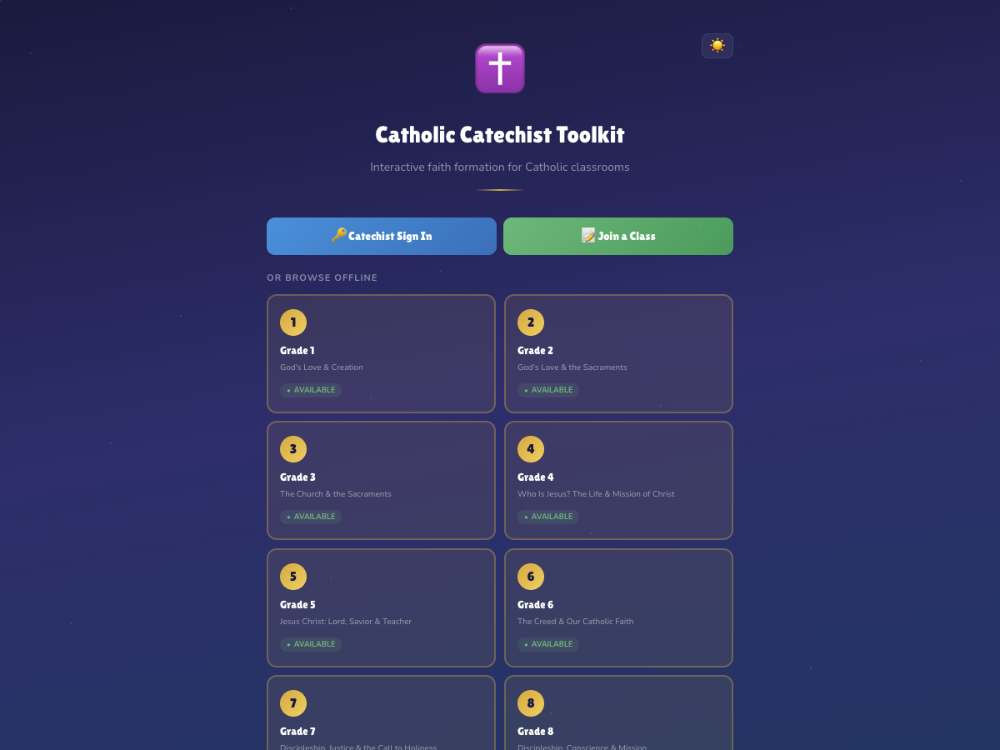

# Catholic Catechist Toolkit

[](https://github.com/jcrowan3/CatholicEdu/actions/workflows/ci.yml)
[](LICENSE)
[](#curriculum-and-content)

An offline-friendly, open-source toolkit for Catholic parish faith formation. It gives catechists 30 interactive sessions per grade and gives students short activities, quizzes, guided prayer, vocabulary, bookmarks, and progress tracking.



> [!IMPORTANT]
> This is an independent community project. It is not an official publication of the Holy See, a diocese, the USCCB, or a curriculum publisher. Parishes remain responsible for local safe-environment, privacy, accessibility, and doctrinal review requirements.

## Why use it?

- **Start locally in minutes.** Offline mode needs only Node.js and stores data in the browser.
- **Use classroom-friendly activities.** Discover cards, sorting, timelines, fill-in-the-blank exercises, quizzes, and guided prayers are included.
- **Choose the operating model.** Run entirely offline or add the FastAPI/PostgreSQL backend for multi-device sync and class join codes.
- **Inspect and adapt it.** The application, curriculum files, tests, provenance notes, and deterministic doctrinal-review rules are all visible in the repository.
- **Export useful artifacts.** Catechists can create session handouts, standards-coverage PDFs, progress CSVs, and family communication exports.

## Quick start

### Offline classroom mode

Requirements: Node.js 22.13 or later and npm.

```bash
git clone https://github.com/jcrowan3/CatholicEdu.git
cd CatholicEdu/frontend
npm ci
npm run dev
```

Open <http://localhost:5173>, choose a grade, and complete the local setup. Data remains in that browser's `localStorage`; it is not synchronized or backed up automatically.

### Full stack with Docker

Requirements: Docker with Compose.

```bash
git clone https://github.com/jcrowan3/CatholicEdu.git
cd CatholicEdu
docker compose up --build
```

Open:

- Application: <http://localhost:5173>
- API documentation: <http://localhost:8000/docs>

Compose waits for PostgreSQL, applies pending Alembic migrations, and then starts the API and frontend. Stop the stack with `docker compose down`; do not add `--volumes` if you want to preserve local database data.

The Compose configuration is for local development. Its database password and JWT secret must never be reused in a deployed environment. See [deployment guidance](docs/deployment.md) before hosting the toolkit.

### Full stack without Docker

Requirements: Node.js 22.13+, Python 3.12+, [uv](https://docs.astral.sh/uv/), and PostgreSQL 17+.

In one terminal, start the backend:

```bash
cd backend
cp .env.example .env
export JWT_SECRET="$(openssl rand -hex 32)"
uv sync --frozen --extra dev
uv run alembic upgrade head
uv run uvicorn catechist_api.main:app --reload
```

In a second terminal from the repository root, start the frontend:

```bash
cd frontend
npm ci
npm run dev
```

## Operating modes

| Capability | Offline | Online |
| --- | --- | --- |
| Curriculum and activities | Yes | Yes |
| Browser-local progress and bookmarks | Yes | Cached locally |
| Multi-device synchronization | No | Yes |
| Catechist accounts and class join codes | No | Yes |
| PostgreSQL reporting | No | Yes |
| Internet required during a session | No, after PWA assets are cached | Normally yes |

## Development

Run the complete repository gate from the project root:

```bash
./scripts/check.sh
```

Or run each side independently:

```bash
cd frontend
npm run lint
npm test
npm run audit:content
npm run build
npm run test:e2e

cd ../backend
uv sync --frozen --extra dev
uv run ruff check src tests
uv run ruff format --check src tests
uv run pytest --cov=catechist_api
```

Pull requests run the same checks in GitHub Actions. See [CONTRIBUTING.md](CONTRIBUTING.md) for the expected workflow.

## Architecture

```text
Browser / PWA
├── React + Vite interface
├── grade curriculum loaded on demand
├── offline localStorage adapter
└── optional REST client
        │
        ▼
FastAPI service
├── JWT authentication
├── parish-scoped services
├── SQLAlchemy models and Alembic migrations
└── PostgreSQL
```

Read [docs/architecture.md](docs/architecture.md) for the main modules, data boundaries, and extension points.

## Documentation

- [Architecture](docs/architecture.md) — components, data flow, and extension points.
- [Deployment](docs/deployment.md) — production configuration and operational requirements.
- [Privacy and safeguarding](docs/privacy-and-safeguarding.md) — student-data and parish-process considerations.
- [Production hosting roadmap](docs/production-roadmap.md) — controls required before operating an internet-facing student service.
- [Content and review](docs/content-and-review.md) — curriculum editing and human-review expectations.
- [AI content provenance audit](docs/ai-content-provenance-audit.md) — content origins and tracked review posture.
- [Qualified curriculum review](docs/curriculum-review/README.md) — grade-level review workflow and evidence requirements.
- [Contributing](CONTRIBUTING.md) — development workflow and pull-request expectations.
- [Security policy](SECURITY.md) — supported versions and private vulnerability reporting.
- [Changelog](CHANGELOG.md) — notable release changes.

## Curriculum and content

Grades 1–8 include 30 sessions each: 240 sessions in total. Every session includes discover cards, one interactive practice activity, a five-question quiz plus bonus, and guided prayer. Curriculum modules live in `frontend/src/data/grade*.js` and are loaded only when a grade is selected.

- Scripture quotations identify the Catholic Public Domain Version (CPDV). The [translator's site](https://sacredbible.org/studybible/version.htm) states that the CPDV is in the public domain.
- Catechism references point readers to numbered paragraphs; the project does not reproduce the full Catechism.
- Curriculum may include AI-assisted drafting. Provenance and current review posture are documented in [docs/ai-content-provenance-audit.md](docs/ai-content-provenance-audit.md) and enforced by `npm run audit:content`.
- Automated tests verify the 30-week sequence and the integrity of discover cards, sorting groups, timelines, fill-in-the-blank prompts, quizzes, bonuses, and prayers across every active grade.
- Automated doctrinal checks are guardrails, not a substitute for review by an appropriately qualified catechist, pastor, or diocesan authority.

See [docs/content-and-review.md](docs/content-and-review.md) before editing or redistributing curriculum.

## Privacy and safeguarding

This application can store student display names, progress, family contact information, permissions, and sensitive notes. Do not enter data unless your parish has an approved purpose, retention policy, access model, and parent/guardian process. Review [docs/privacy-and-safeguarding.md](docs/privacy-and-safeguarding.md) before using real student information.

Security issues should be reported privately according to [SECURITY.md](SECURITY.md), not through a public issue.

## Project status

The software, automated checks, Docker development stack, and public-project documentation are release-candidate ready. The curriculum remains suitable for evaluation and qualified local review; it should not be treated as approved for parish use, as a hosted compliance-certified student information system, or as a substitute for parish or diocesan review. Hosting gaps are explicit in the [production roadmap](docs/production-roadmap.md), and current changes are tracked in [CHANGELOG.md](CHANGELOG.md).

## Contributing

Contributions are welcome, especially for accessibility, test coverage, curriculum review, translations, privacy safeguards, and deployment documentation. Start with [CONTRIBUTING.md](CONTRIBUTING.md) and follow the [Code of Conduct](CODE_OF_CONDUCT.md).

## License

Unless a file says otherwise, repository code and original project content are available under the [MIT License](LICENSE). Public-domain source material remains public domain, and third-party names and references remain subject to their respective rights.
