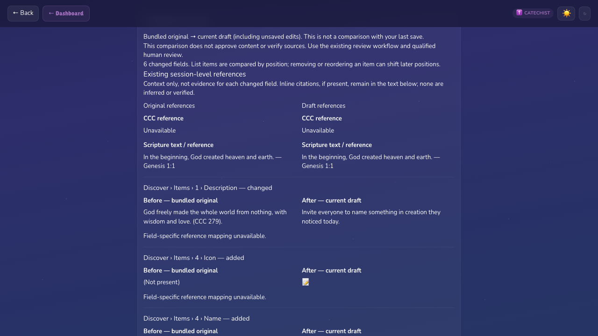

# Single-session adaptation summary — packet 1f001281

## Outcome and established gap

At base `c94567ef2a864cfdaf22015705a2301344da4a6d`, SessionEditor exposes the
current draft, Review & Save, reset, and PDF, but no original/draft comparison.
`data/store.js` stores overrides, while `data/gradeLoader.js` independently loads
bundled defaults. `utils/generateSessionPdf.js` exports one current session only.
`utils/doctrinalReview.js`, `docs/content-and-review.md`, and the qualified review
workflow do not reconstruct adaptations. The September 11 open-PR query returned
no PRs; open issues 30–33 concern qualified review and operations, not this feature.

This is a demonstrated local workflow gap, not evidence of Catholic parish demand.
External research about higher-education tools did not determine the implementation.
Human preparation time, educator access, and downstream review quality remain unknown.

## Reproducible fixture and baseline

`frontend/e2e/fixtures/adaptation.js` clones the existing Grade 1, week 1 session:

1. Replace Discover item 1's description (which includes `CCC 279`) with a
   synthetic classroom instruction without a citation.
2. Add a fourth Discover item (icon, name, description), also without a citation.
3. Remove the final prayer line (`A`, `Amen.`).

The manually enumerated six changed leaf paths are in `expectedPaths`; every
before/after value is checked in the browser test. The fixture does not change
bundled curriculum. The existing Grade 1 session has no top-level `ccc`; its
reference is inline, and the summary must not invent a top-level reference.

With a local Vite server running on port 4173:

```sh
cd frontend
npm ci
npm run dev -- --host 127.0.0.1 --port 4173
# In another terminal, still in frontend:
node scripts/measure-adaptation-baseline.js
npm run test:e2e -- e2e/adaptation-summary.spec.js
```

The baseline script opens an original and a draft separately and captures each
version's metadata, expanded Discover, and expanded prayer pane. It is a bounded
**automated reconstruction proxy**, not a person copying to the clipboard. It
assumes the changed sections are already known; discovering arbitrary changes
would require inspecting the remaining sections too. Original access is supplied
by the seeded fixture: a real user needs an untouched copy or repository source;
resetting the draft is not a safe way to reconstruct the removed text.

Observed initial run on September 11, 2026:

| Observation | Existing workflow proxy | Summary fixture browser check |
| --- | --- | --- |
| Editor openings | 2 | 1 |
| Section/summary expansions | 4 section expansions | 1 summary expansion |
| Pane-copy equivalents for reconstruction | 6 | 0 |
| Separate session-reference lookups | 2 | 0 (displayed together) |
| Automated wall time | 7,615 ms | 4,433 ms desktop; 4,380 ms mobile |

The after time includes assertions and runs alongside other browser tests. These
are observed technical timings, **not a controlled performance comparison or a
claimed percentage reduction in educator effort**. Browser tests log fresh timings
on each run. Eliminating separate before/after pane assembly is directly verified;
actual human benefit needs a separately authorized paired trial.

## Scope and semantics

- The original is explicitly the **currently bundled curriculum**, not the last
  saved draft, a historical curriculum version, or a saved approval.
- All JSON fields in the existing session shape are compared, including fields
  not exposed by editor controls. Arrays compare by position. Middle removals or
  reordering may therefore show shifts; no semantic identity is inferred.
- Additions, removals, empty text, null, and empty containers remain distinct.
  Inline citations remain verbatim in changed text. Existing session-level CCC
  and Scripture values appear as context, not field-level attribution. There is
  no field-source mapping in this data, so each row labels it unavailable.
- Comparison derives from the current editor state on every render, including
  unsaved edits. Original loading is grade-keyed; errors or unknown weeks show an
  unavailable state instead of incorrectly reporting no changes.
- The native disclosure sits beside Review & Save. It adds no storage writes,
  approvals, network API endpoints, source lookup service, exports, or curriculum
  edits. Existing review and save lifecycle code remain unchanged.

## Necessary integration fix

The baseline also reproduced opening Quick Quiz crashing with
`Cannot read properties of undefined (reading 'map')`: the editor read `options`,
while bundled quiz questions use `opts`. The narrow fix reads/writes the existing
key, preserving legacy `options` records and avoiding schema changes. Browser
checks cover both shapes, edit/save/reload, and correct draft comparison.

## Verification and limits

Focused Node checks cover exact fixture leaves, additions/removals, current-state
updates, null/missing/empty values, middle removals, hidden bonus fields, and all
240 bundled sessions. Desktop and Pixel 7 Chromium browser checks cover:

- exact six-field rendered context and missing-source indicators;
- live title/quiz edits, reset, unchanged and unavailable originals, failed load;
- draft save/reload and a real PDF download with a PDF header;
- a known doctrinal error still blocked by the existing deterministic review;
- legacy quiz shape preservation, summary-only axe checks, and no horizontal overflow.

Accessibility checks target the new summary, not a claim that all editor controls
meet accessibility standards. API-backed hosted saving is not exercised by the
new offline fixture; the unchanged save lifecycle and repository API tests provide
separate coverage. No deployed impact or qualified doctrinal approval is claimed.
The full repository gate is `./scripts/check.sh`; exact-head results and CI state
belong in the PR evidence, not in inferred claims from passing local counts.

### Observed desktop view

The screenshot shows the expanded summary's references and first changed fields;
remaining additions/removals continue below the viewport. Mobile rendering and
no-horizontal-overflow checks run separately in the fixture test.


